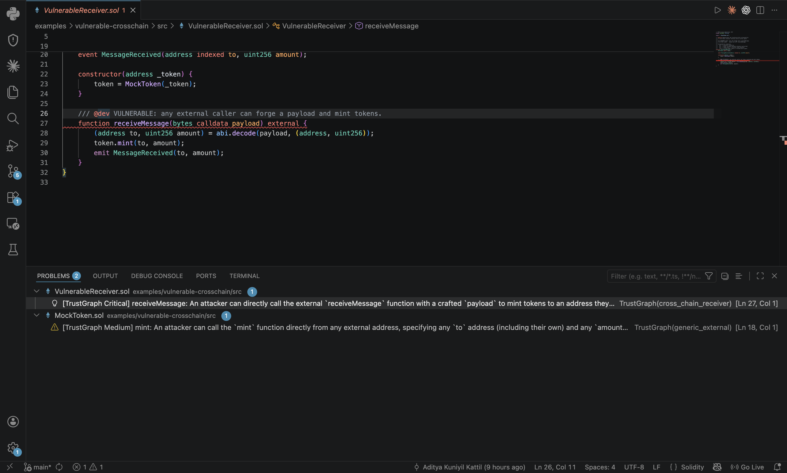
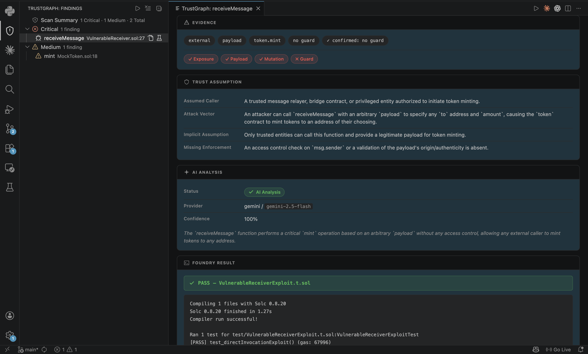
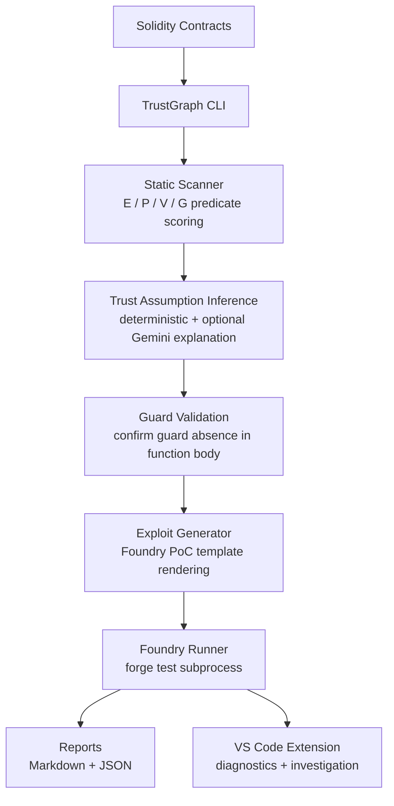
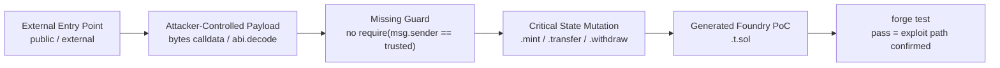
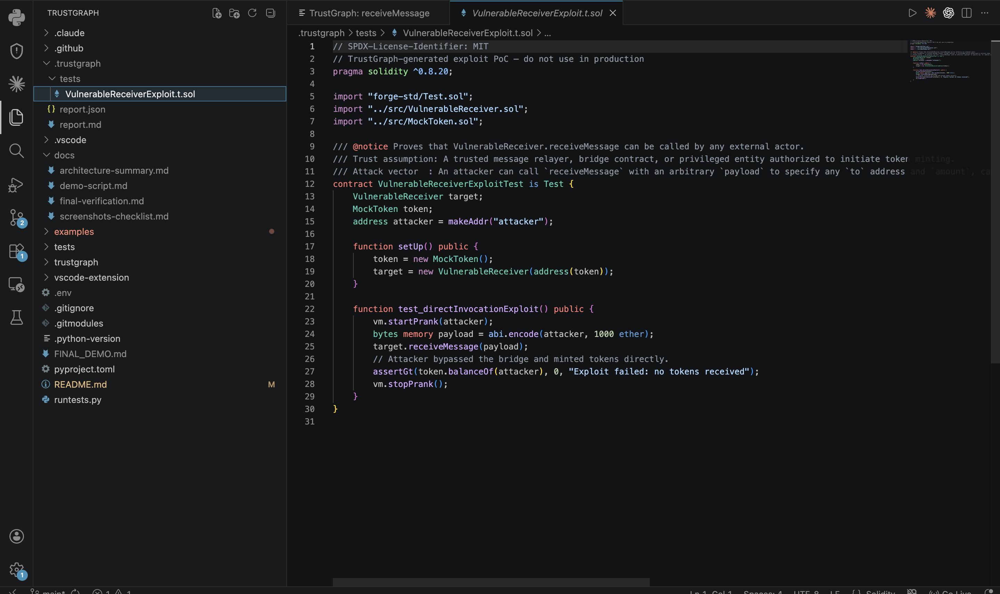
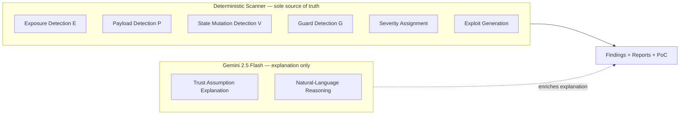

# TrustGraph

> **Deterministic Solidity trust-boundary analysis with Foundry exploit proof generation.**

<!-- GitHub repo description: "Deterministic Solidity trust-boundary analysis with executable Foundry exploit validation." -->
<!-- GitHub topics: solidity smart-contracts security static-analysis foundry exploit-generation vscode-extension ethereum defi-security web3-security -->

TrustGraph scans Solidity contracts for externally callable functions that accept attacker-controlled payloads without caller guards, generates a Foundry PoC test for each finding, and runs it via `forge test`. A VS Code extension exposes findings as inline diagnostics with a full investigation sidebar.

**Detection is deterministic**: a four-predicate rule set (E ∧ P ∧ V ∧ ¬G) determines every finding and severity assignment. Optional Gemini 2.5 Flash adds a plain-language explanation after the finding is complete — it cannot create, modify, or suppress findings.

---

## Quick Demo

```bash
trustgraph audit examples/vulnerable-crosschain/src \
  --generate-test \
  --run-foundry \
  --report-format both \
  --output-dir .trustgraph
```

```
Critical → receiveMessage   VulnerableReceiver.sol:27
Medium   → mint             MockToken.sol:18

[PASS] test_directInvocationExploit() (gas: 67996)
```

```
.trustgraph/
├── report.md
├── report.json
└── tests/
    └── VulnerableReceiverExploit.t.sol
```

---

## Why TrustGraph Exists

Cross-chain bridge receiver functions are a recurring attack surface: an `external` function accepts an arbitrary payload with no `msg.sender` check, so any address can trigger privileged state changes directly. The August 2024 CrossCurve bridge exploit (~$5M) is a concrete example; the same pattern appears across LayerZero receivers, Axelar gateways, and custom bridge integrations.

TrustGraph addresses this class with three engineering guarantees:

- **Auditable findings** — every result traces to a fixed predicate (E ∧ P ∧ V ∧ ¬G) evaluated against function source text. No model confidence scores, no sampling variance.
- **Executable PoC** — each Critical or Medium finding produces a Foundry test. If `forge test` passes, the specific exploit path is confirmed. If it fails, the finding is still reported with the test attached for manual review.
- **No LLM in the decision path** — Gemini is an optional explanation layer added after severity is assigned. Pass `--no-ai` and the scanner, exploit generator, and reports are unchanged.

---

## Design Principles

**Deterministic analysis over probabilistic scoring.** Findings are produced by an explicit, fixed predicate. The same function source produces the same result on every run. Nothing is tuned, sampled, or model-dependent.

**Reproducible exploit validation.** Each finding is backed by a generated Foundry test. Exploitability of the generated path is a binary outcome — `forge test` passes or it does not.

**Human-auditable evidence.** Every finding exposes the matched predicate conditions and the function source that triggered them. No black-box reasoning.

**Optional AI enrichment, never AI dependency.** Gemini adds a plain-language explanation once the finding is complete. Disable it with `--no-ai` and the tool is functionally identical.

**Developer workflow integration.** Findings surface in the editor as diagnostics, not just a report file. The investigation path is: inline highlight → findings sidebar → detail panel → exploit test → patch template.

---

## Non-Goals

TrustGraph is scoped to a specific vulnerability class. It explicitly does not attempt to:

- **Symbolic execution** — no SMT solver, no path exploration, no formal verification
- **Full contract auditing** — does not reason about reentrancy, integer overflow, access control patterns beyond caller guards, or arbitrary vulnerability classes
- **Cross-file or cross-contract analysis** — each function is evaluated within its source file
- **Autonomous patching** — patch templates are human-review suggestions only; no code is modified automatically
- **Audit replacement** — TrustGraph surfaces trust-boundary candidates; it is not a substitute for a professional audit
- **Production readiness certification** — a passing PoC confirms the generated exploit path executes; it makes no claim about other attack surfaces

---

## Features

- Four-predicate static analysis (E/P/V/G) across all externally callable functions
- Cross-chain receiver vulnerability detection
- Auto-generated Foundry exploit PoC tests, executed via `forge test`
- Optional Gemini 2.5 Flash explanation layer — detection and severity are unaffected
- Automatic fallback to deterministic-only when Gemini is absent or errors
- Markdown + JSON report output
- VS Code extension: inline diagnostics, findings sidebar, exploit test viewer, patch templates
- GitHub Actions CI/CD workflow included

---

## Installation

**Requirements:** Python ≥ 3.10, [Foundry](https://book.getfoundry.sh/getting-started/installation) (required for `--run-foundry`)

```bash
git clone https://github.com/your-org/trustgraph
cd trustgraph
pip install -e .
```

**With optional Gemini explanation:**

```bash
pip install -e ".[gemini]"
export GEMINI_API_KEY="your_key_here"
export GEMINI_MODEL="gemini-2.5-flash"   # optional, this is the default
```

Without a Gemini API key, TrustGraph runs deterministic-only automatically. Keys can also go in a `.env` file (gitignored):

```
GEMINI_API_KEY=your_key_here
```

---

## Usage

```bash
# Basic audit
trustgraph audit path/to/contracts/src

# Generate Foundry exploit PoC tests
trustgraph audit path/to/src --generate-test

# Generate tests + run forge test
trustgraph audit path/to/src --generate-test --run-foundry

# Markdown + JSON reports
trustgraph audit path/to/src --report-format both

# Deterministic-only (no LLM calls)
trustgraph audit path/to/src --no-ai
```

**All options:**

```
Arguments:
  PATH                    .sol file or directory  [required]

Options:
  --generate-test / --no-generate-test   Generate Foundry exploit PoC  [default: generate-test]
  --run-foundry / --no-run-foundry       Execute forge test             [default: no-run-foundry]
  --report-format TEXT                   markdown | json | both         [default: markdown]
  --output-dir TEXT                      Output directory               [default: trustgraph-output]
  --no-ai                                Disable LLM calls
```

---

## VS Code Investigation Workflow

TrustGraph ships with a local VS Code extension for interactive investigation.

**Setup:**

```bash
cd vscode-extension
npm install
npm run compile
```

1. Open `vscode-extension/` in VS Code and press **F5** to launch the Extension Development Host.
2. Open the main TrustGraph repo in the new window.
3. Run `TrustGraph: Run Audit` from the Command Palette.

**Recommended `.vscode/settings.json`:**

```json
{
  "trustgraph.cliPath": "/path/to/trustgraph",
  "trustgraph.contractPath": "examples/vulnerable-crosschain/src",
  "trustgraph.outputDir": ".trustgraph",
  "trustgraph.runFoundry": true
}
```

Reports and exploit tests are written to `.trustgraph/` (gitignored).

**Extension features:**

| Feature | Description |
|---|---|
| Inline diagnostics | Red/yellow squiggles on vulnerable functions |
| Findings sidebar | Severity-grouped tree with scan summary |
| Detail webview | Predicate evidence, guard verdict, Gemini explanation, Foundry result, patch template |
| Go to Source | Jump to the flagged line |
| Open Exploit Test | Open the generated `.t.sol` |
| Copy Patch | Copy the recommended fix to clipboard |

**Inline diagnostics — vulnerable function highlighted in-editor with PROBLEMS panel entries:**



**Findings sidebar — severity-grouped tree, populated after a scan:**


**Critical finding detail panel — predicate evidence, trust assumption breakdown, Foundry result:**



---

## Vulnerability Model

A function is flagged when all four predicate conditions hold:

```
Vulnerable(f) = E(f) ∧ P(f) ∧ V(f) ∧ ¬G(f)
```

| Predicate | Meaning | How detected |
|---|---|---|
| `E(f)` | `external` or `public` visibility | Visibility keyword match on function signature |
| `P(f)` | Accepts attacker-controlled payload | `bytes calldata`, `abi.decode`, param names containing `payload`/`data`/`message` |
| `V(f)` | Critical state mutation in body | `.mint(`, `.transfer(`, `.withdraw(`, `balances[` |
| `G(f)` | Caller guard present in body | `require(msg.sender ==`, `onlyOwner`, `onlyBridge`, `trustedBridge` |

> **False negative note:** `G(f)` is evaluated within the function body only. Guards expressed as function modifiers, inherited from a parent contract, or present in a calling function are not detected. See [Limitations](#limitations).

**Severity assignment:**

| Conditions | Severity |
|---|---|
| E + P + V + no guard | **Critical** |
| E + V + no guard | **Medium** |
| Otherwise | Informational |

---

## Architecture



The pipeline runs as an 8-stage DAG using [LangGraph](https://github.com/langchain-ai/langgraph) as the execution framework. Each stage is a pure function on a typed state object; LangGraph is not used for agent planning or LLM routing — it handles DAG wiring and state passing only.

**Project layout:**

```
trustgraph/
├── cli.py              — Typer CLI entry point
├── graph.py            — 8-stage pipeline DAG
├── models.py           — Pydantic models + WorkflowState
├── scanners/
│   └── solidity.py     — Function extractor + E/P/V/G scorer
├── agents/
│   ├── trust_assumption.py   — Deterministic classifier + optional Gemini call
│   ├── exploit_generator.py  — Foundry PoC template engine
│   └── patch_recommender.py  — Patch suggestion templates
├── runners/
│   └── foundry.py      — forge test subprocess wrapper
└── reports/
    ├── markdown.py     — Markdown report generator
    └── json_report.py  — JSON report generator
```

---

## Exploit Lifecycle



**Generated exploit test — Foundry PoC produced by TrustGraph for the bundled example:**



---

## Deterministic-First Design



Gemini is called once per finding after severity is already assigned. It receives the function source and the predicate verdicts as context. Its output populates the `ai_analysis` field in reports and the VS Code detail panel. It cannot change `severity`, `is_vulnerable`, or exploit generation.

**Gemini fallback behaviour:**

| Condition | Behaviour |
|---|---|
| `--no-ai` passed | Deterministic only — no API call made |
| No `GEMINI_API_KEY` | Deterministic fallback, finding still reported |
| API error or quota exceeded | Deterministic fallback, finding still reported |
| Invalid or unparseable response | Deterministic fallback, finding still reported |
| Success | Finding enriched with natural-language explanation |

---

## CI/CD

TrustGraph includes a GitHub Actions workflow (`.github/workflows/trustgraph.yml`) that:

1. Checks out the repo with submodules (forge-std)
2. Installs TrustGraph and Foundry
3. Runs the audit against the bundled example contracts
4. Asserts a Critical `receiveMessage` finding is detected
5. Uploads reports as build artifacts

---

## Limitations

Detection operates on individual function bodies via keyword pattern matching. Current scope boundaries:

- **Modifier-only guards not detected** — `onlyOwner` on the function signature is not evaluated; only `require(...)` inside the function body is checked
- **No inheritance resolution** — guards defined in a parent contract are not traced into the child
- **No cross-function guard propagation** — a guard in a wrapper or calling function is not credited to the callee
- **Single-file scope** — data flows across multiple `.sol` files are not tracked
- **Pattern-sensitive** — non-standard naming conventions may produce false negatives; unusual patterns may produce false positives

---

## Future Work

- AST-level parsing via `solc --ast-compact-json` to replace keyword extraction
- Modifier and inheritance resolution
- Cross-function and cross-contract call graph analysis
- Slither integration as a complementary analysis pass
- Semgrep rule export from confirmed findings

---

## Security Disclaimer

TrustGraph is an early-stage tool and has not itself been security-audited.

A passing Foundry test confirms that the generated exploit PoC executes successfully against the generated test harness. It does not prove the absence of other attack paths or that the contract is otherwise safe. All findings require human review before drawing production conclusions. TrustGraph is not a substitute for a professional smart contract audit.

---

## Contributing

See [CONTRIBUTING.md](CONTRIBUTING.md) for dev setup, test instructions, the deterministic-first design constraint, and the PR checklist.

---

## Acknowledgements

Motivated by the August 2024 CrossCurve bridge exploit and the broader class of trust-boundary failures in cross-chain receiver architectures.
