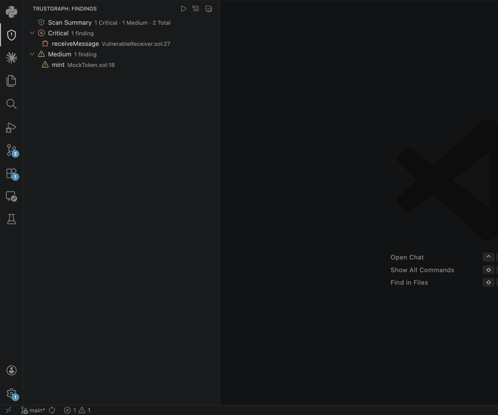

# TrustGraph — Solidity Trust-Boundary Analyser

Inline diagnostics and investigation workflow for [TrustGraph](https://github.com/Akk525/trustGraph), a deterministic Solidity trust-boundary scanner that generates reproducible Foundry proof tests.

---

## What This Extension Does

TrustGraph identifies externally callable Solidity functions that accept untrusted caller input without caller guards — a recurring unsafe trust path in bridge receivers, cross-chain handlers, and token contracts. Detection uses a fixed four-predicate rule set (E ∧ P ∧ V ∧ ¬G). No model confidence scores, no sampling variance.

This extension surfaces those findings directly in VS Code:

- **Inline diagnostics** — red squiggles for Critical, yellow for Medium
- **Findings sidebar** — severity-grouped tree with scan summary
- **Detail webview** — evidence, trust assumption, Gemini explanation (optional), Foundry test result, patch template
- **One-click navigation** — jump to source line, open generated proof test, copy patch

---

## Screenshots

**Findings sidebar with severity groups and scan summary**



**Inline diagnostic on a vulnerable function**


**Finding detail panel — evidence, analysis, Foundry result, patch**


**Generated Foundry proof test**


---

## Requirements

- **TrustGraph CLI** installed and on PATH (or set `trustgraph.cliPath`)
  - Install: `pip install trustgraph` *(or clone and install from [source](https://github.com/Akk525/trustGraph))*
- **VS Code** 1.85 or later
- **Foundry** (`forge`) — required only if `trustgraph.runFoundry` is enabled

> **Gemini explanations are optional.** TrustGraph reads `GEMINI_API_KEY` from your local shell environment or a `.env` file in the CLI's working directory. API keys are never required for deterministic analysis and must not be committed to source control.

---

## Install

Install from the [VS Code Marketplace](https://marketplace.visualstudio.com/items?itemName=akk525.trustgraph) or search **TrustGraph** in the Extensions panel.

---

## Workflow

1. Open a Solidity project in VS Code.
2. If `trustgraph` is not on PATH, set `trustgraph.cliPath` in settings.
3. Run **TrustGraph: Run Audit** from the Command Palette (`Ctrl+Shift+P` / `Cmd+Shift+P`).
4. A progress notification appears; CLI output streams to the **TrustGraph** Output channel.
5. On completion:
   - Critical findings appear as **red squiggles** in `.sol` files.
   - Medium findings appear as **yellow squiggles**.
   - The **TrustGraph sidebar** (shield icon in the Activity Bar) shows a scan summary and findings grouped by severity.
6. Click any finding to open the detail panel: evidence, trust assumption, optional Gemini explanation, Foundry CI result, and patch template.
7. Right-click a finding in the sidebar for the context menu: **Open Detail**, **Go to Source**, **Open Proof Test**, **Copy Patch**.

---

## Generated Output

All generated files are written to `.trustgraph/` inside your workspace root by default:

```
<workspace>/
  .trustgraph/
    report.md
    report.json
    tests/
      ReceiverProofTest.t.sol
```

Add `.trustgraph/` to your `.gitignore` to avoid committing generated outputs. Change the location with the `trustgraph.outputDir` setting.

---

## Configuration

All settings are under `trustgraph.*` in VS Code settings (`Ctrl+,` / `Cmd+,`):

| Setting | Default | Description |
|---|---|---|
| `trustgraph.contractPath` | workspace root | Path to a `.sol` file or directory (relative or absolute) |
| `trustgraph.outputDir` | `.trustgraph` | Output directory for reports and generated tests |
| `trustgraph.generateTest` | `true` | Generate Foundry proof tests for trust-boundary findings |
| `trustgraph.runFoundry` | `false` | Execute `forge test` after generating tests |
| `trustgraph.reportFormat` | `both` | `markdown`, `json`, or `both` |
| `trustgraph.cliPath` | *(PATH lookup)* | Full path to the `trustgraph` binary |

Relative paths in `contractPath` and `outputDir` are resolved against the workspace root.

If the `trustgraph` binary is in a virtualenv or pyenv that VS Code's PATH doesn't include, set `cliPath` explicitly:

```json
"trustgraph.cliPath": "/Users/you/.pyenv/versions/3.12.4/bin/trustgraph"
```

---

## Commands

| Command | Trigger |
|---|---|
| **TrustGraph: Run Audit** | Command Palette; sidebar toolbar ▶ button |
| **TrustGraph: Clear Findings** | Command Palette; sidebar toolbar ✕ button |
| **Open Detail** | Right-click finding in sidebar |
| **Go to Source** | Right-click finding in sidebar |
| **Open Proof Test** | Right-click finding in sidebar |
| **Copy Patch** | Right-click finding in sidebar |
| **TrustGraph: Open Report File** | Command Palette |

---

## Troubleshooting

**"Audit failed or report.json not found"**
Check the **TrustGraph** Output channel (`View → Output → TrustGraph`) for the full command and error. Confirm `trustgraph.cliPath` is correct and `trustgraph.contractPath` points to a valid `.sol` file or directory.

**"Source file not found" / "Proof test file not found"**
The resolved path is logged in the Output channel. If you changed `trustgraph.outputDir` after running an audit, re-run the audit to regenerate with the current path.

**Gemini quota exceeded**
The detail panel shows "Gemini quota exceeded; deterministic fallback used." Findings are still complete — only the plain-language explanation is unavailable. The audit result is valid.

**No Gemini API key**
If `GEMINI_API_KEY` is not set in the shell that launched VS Code, the tool falls back to deterministic classification automatically. The audit is unaffected.

**Foundry not installed**
If `trustgraph.runFoundry` is `true` but `forge` is not on PATH, the Foundry step fails and findings show "NOT RUN" in the detail panel. Install via `curl -L https://foundry.paradigm.xyz | bash && foundryup`.

**Extension does not activate**
The extension activates when a `.sol` file is opened or the TrustGraph sidebar is clicked. Run **Developer: Reload Window** if neither fires.

---

## Limitations

- Analyses one file or directory at a time — no cross-project scanning
- Detection is scoped to the trust-boundary class (E ∧ P ∧ V ∧ ¬G); does not cover reentrancy, overflow, or other issue classes
- No cross-file or cross-contract dataflow — each function is evaluated within its source file
- Gemini explanation is optional and informational only; it cannot affect findings
- Requires the TrustGraph CLI to be installed separately

---

## Links

- [TrustGraph repository](https://github.com/Akk525/trustGraph)
- [CLI documentation](https://github.com/Akk525/trustGraph#readme)
- [Issue tracker](https://github.com/Akk525/trustGraph/issues)
- [License: MIT](https://github.com/Akk525/trustGraph/blob/main/LICENSE)
